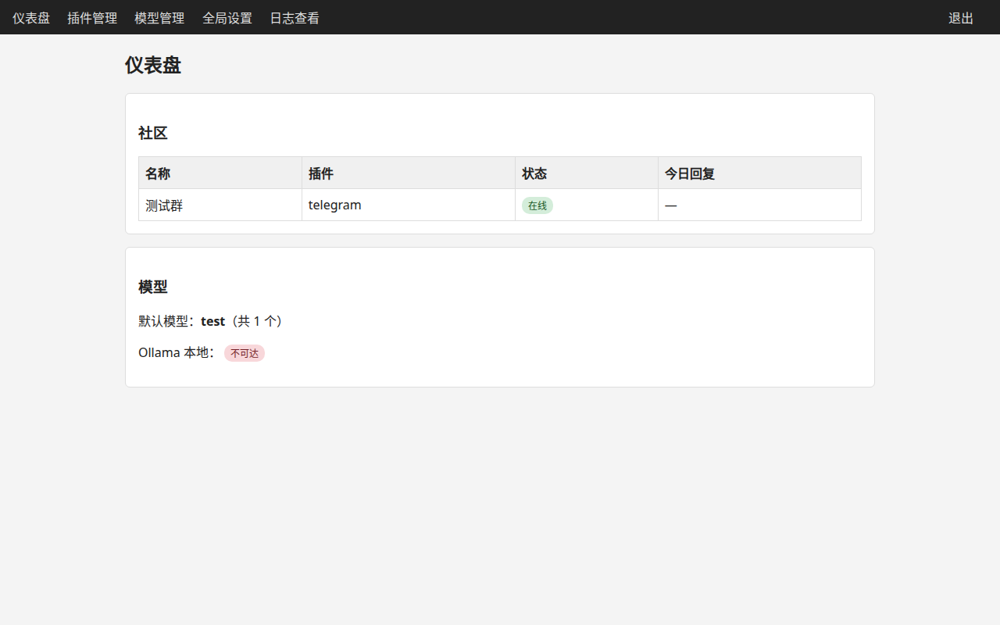
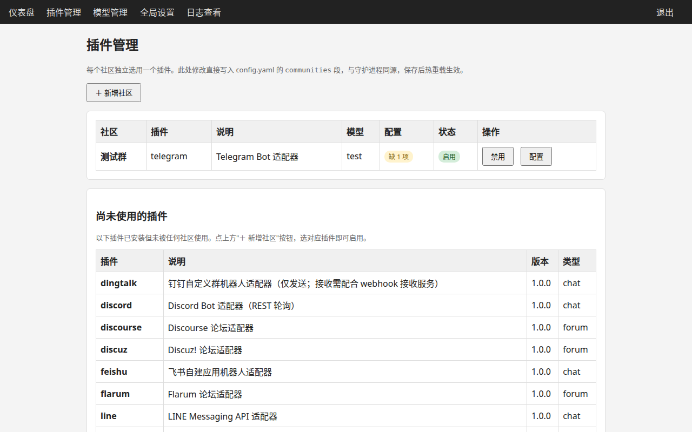
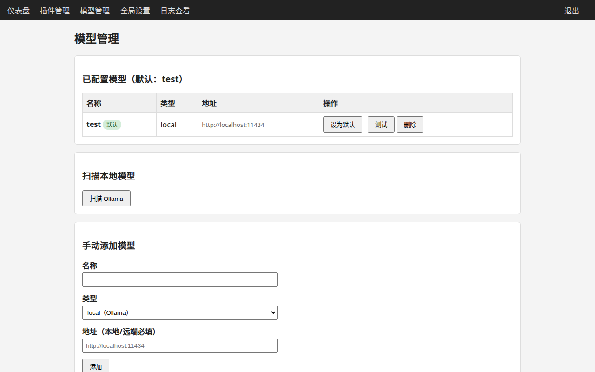
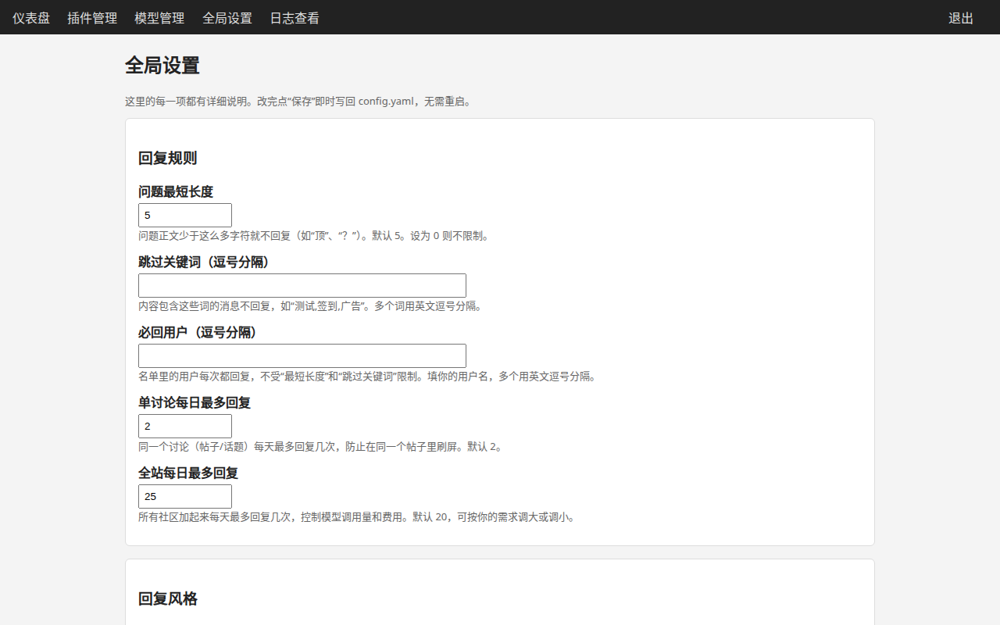
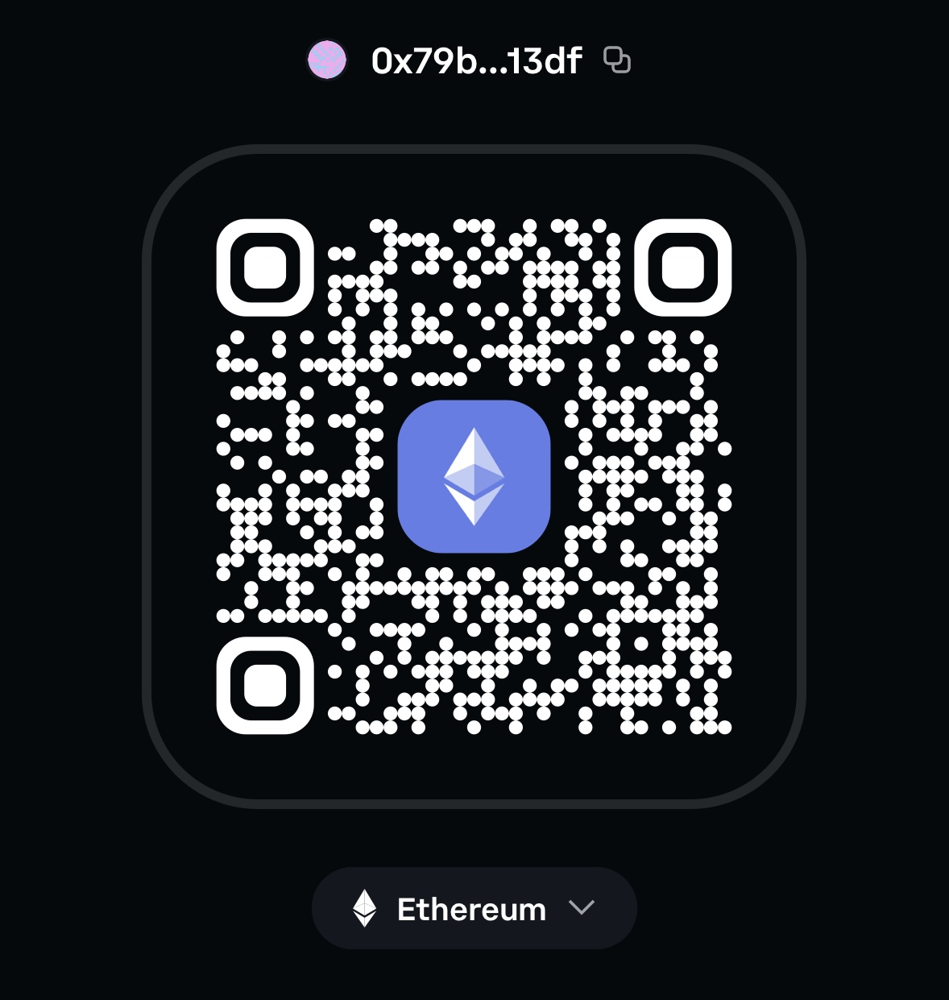

# 社区机器人 (Community Bot)

> **一句话介绍**：这是一个自动帮你回复论坛帖子 / 群消息的机器人。
> 你告诉它去哪个论坛或群、用什么"大脑"（AI 模型），它就会 24 小时帮你回帖。

## 开始之前（先看这 3 条）

**你需要**：
- ⬜ 一台电脑（Windows / Mac / Linux 都行，最好能长期开机）
- ⬜ 一个论坛或聊天平台的**管理员 / Bot 权限**（比如论坛 API Token、Telegram Bot Token——没有这个机器人连不上你的社区）
- ⬜ 会复制粘贴命令（跟着 [安装指南](docs/安装指南.md) 一步步来就行）

**⚠️ 不适合你**：如果你只是普通群成员（没有管理员权限）、或者看到黑窗口就头疼，
可以先找个懂技术的朋友帮忙装。装好之后日常使用全在网页上点，不用再碰命令行。

不会装？直接看 [docs/安装指南.md](docs/安装指南.md)，从"安装 Python"开始手把手教你。

## 界面预览

| 总览 | 社区管理 |
|------|---------|
|  |  |

| 模型管理 | 全局设置 |
|---------|---------|
|  |  |

---

一个可配置的多平台社区助教机器人。支持多种社区平台、多种模型后端，带 Web 可视化管理。

## 功能

- **多平台适配**：论坛类（Flarum、Discourse、phpBB、NodeBB、Discuz!）+ 即时通讯类（Telegram、Discord、飞书、钉钉、企业微信、Slack），详见 [docs/ADAPTERS.md](docs/ADAPTERS.md)
- **自由模型层**：本地 Ollama、远端自建、商业 API（OpenAI、Google Gemini、Anthropic）
- **Web 管理**：仪表盘、规则配置、模型管理、日志查看
- **梯度轮询**：按帖子活跃度分级检查（Hot/Warm/Cold/Archived），不刷浏览量
- **完整性校验**：回复生成后自检，思维链泄露、截断自动丢弃

## 快速开始

```bash
# 1. 安装依赖
pip install -r requirements.txt

# 2. 复制配置
cp config/config.example.yaml config/config.yaml

# 3. 编辑配置（社区、模型、规则）
vim config/config.yaml

# 4. 启动守护进程
python -m src.main

# 5. 启动 Web 管理（另开一个终端）
export WEB_PASSWORD="你的管理密码"   # 必设，否则 Web 锁定无法登录
# export WEB_SECRET_KEY=$(openssl rand -hex 32)  # 会话密钥，可选；不设则每次启动随机生成（重启后需重新登录）
python -m src.web.app
```

Web 管理界面：`http://localhost:52323`（默认只监听本机）

详细配置说明见 [docs/CONFIG.md](docs/CONFIG.md)，
本地模型配置见 [docs/LOCAL_MODELS.md](docs/LOCAL_MODELS.md)。

## 配置说明

`config/config.yaml` 是唯一配置源，Web 界面的修改会同步写回此文件。

```yaml
communities:
  - name: "技术交流"
    plugin: flarum          # 插件名（不是 platform）
    enabled: true
    url: "https://example.com"
    # 认证走环境变量，如 FLARUM_TOKEN

models:
  - name: "qwen2.5:7b"
    type: local             # local | remote | openai | gemini | anthropic
    endpoint: "http://localhost:11434"
  - name: "gpt-4o-mini"
    type: openai
    # api_key 通过环境变量 OPENAI_API_KEY 提供

default_model: "qwen2.5:7b"
# fallback_model: "gpt-4o-mini"   # 备用模型（可选）

rules:
  max_replies_per_day: 20   # 全站每天最多回复 20 条（可调）
  max_replies_per_discussion_per_day: 2

tiers:                      # 梯度轮询间隔（秒，可调）
  hot_interval: 60          # 1小时内有活动
  warm_interval: 1800       # 1-24小时
  cold_interval: 604800     # 24小时-3天
```

完整配置说明见 [docs/CONFIG.md](docs/CONFIG.md)，
配置模板见 `config/config.example.yaml`（注释详细，建议对照着改）。

## 文档

| 文档 | 给谁看的 |
|------|---------|
| [docs/安装指南.md](docs/安装指南.md) | 第一次用命令行：分 Windows / Mac / Linux，手把手从装 Python 开始 |
| [docs/FAQ.md](docs/FAQ.md) | 遇到问题先来这查：按"我想…/我遇到了…"找答案 |
| [docs/术语表.md](docs/术语表.md) | 看到不认识的词（守护进程、热重载…）来这查，一句话讲明白 |
| [docs/CONFIG.md](docs/CONFIG.md) | 配置说明：小白先看开头的"小白主路径" |
| [docs/LOCAL_MODELS.md](docs/LOCAL_MODELS.md) | 本地模型（Ollama）安装和配置 |
| [docs/PLUGINS.md](docs/PLUGINS.md) | 插件开发和配置 |

## 模型管理

Web 界面支持：
- **扫描本地**：自动检测 Ollama 已下载模型，一键选用
- **手动添加**：远端/商业模型填地址和密钥
- **测试**：每个模型可发测试 prompt，看延迟和质量

## 本地模型

推荐优先用本地模型（免费、无限量），详见 [docs/LOCAL_MODELS.md](docs/LOCAL_MODELS.md)。

## 插件

平台适配器以插件形式载入，详见 [docs/PLUGINS.md](docs/PLUGINS.md)。

## 协议

本项目采用 [MIT](LICENSE) 协议开源。

第三方依赖的协议清单见 [docs/THIRD_PARTY.md](docs/THIRD_PARTY.md)。

## 打赏

如果这个项目对你有帮助，欢迎请我喝杯咖啡：

| 支付宝 | 微信支付 | 以太坊 |
|--------|----------|--------|
|  |  |  |

以太坊地址：`0x79b046b212c3151e08994e833a51289ca82b13df`
